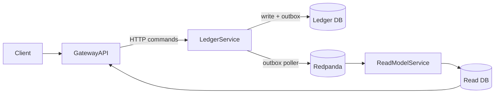

# Credit Ledger (Go + TS + Kafka + Postgres)

> Production-ready **reference architecture** for high-volume financial credits and balances: SaaS credits, marketplace wallets, usage-based billing, and loyalty points.

[](#)
[](#)
[](#)
[](#)
[](#)

**Live demo:** [https://creditledger-gateway-staging.fly.dev/api](https://creditledger-gateway-staging.fly.dev/api)

---

**Credit Ledger** demonstrates event-driven design, double-entry thinking, transactional outbox, CQRS projections, and full observability in a microservices environment.

### Who this is for

- **Fintech / SaaS teams** hitting limits with a single `credits_remaining` field.
- **Marketplaces** needing auditable wallets / balances.
- **Engineers** wanting a template for event-driven, double-entry ledger design in Go.
- **CTOs** evaluating architecture for credits/usage systems before a rewrite.

## Why this exists

Most SaaS and marketplaces start with a `credits_remaining` column or a spreadsheet.
That works… until:

- Support tickets spike (“your system ate my credits”).
- Balances don’t match between dashboards, DB, and invoices.
- Nobody can explain why a customer has 37 credits instead of 41.
- Product wants new bundles/promos and everyone is afraid to touch the code.

**Credit Ledger** shows how to rebuild that into a proper ledger with:
- Immutable history
- Double-entry style thinking
- Replayable projections
- Clear auditability for disputes

## What you can reuse from this repo

- A simple but realistic **domain model** for accounts, credit types, ledger entries, and balances.
- A **transactional outbox** pattern to avoid dual-write hazards.
- **Idempotent consumers** feeding CQRS read models.
- **Observability wiring**: traces (Jaeger), metrics (Prometheus/Grafana), and Kafka/Redpanda topic inspection.
- A Dockerized, `make up` **developer experience** for local demos and workshops.

---

## Architecture at a glance



For the rationale behind key decisions, see [`docs/adr`](./docs/adr).

## Deep dive article

For the story behind this architecture (and when to use it), see:  
[From Spreadsheet Chaos to Reliable Credits](https://medium.com/@amirhosseinfirouzmanesh/from-spreadsheet-chaos-to-reliable-credits-ca8fe19fbdb7).

---

## Example use cases

- [SaaS subscription credits](docs/use-cases/saas-subscription-credits.md)
- [Marketplace listing credits](docs/use-cases/marketplace-listing-credits.md)
- [Wallet & escrow balances](docs/use-cases/wallet-and-escrow.md)
- [Loyalty / points systems](docs/use-cases/loyalty-and-points.md)

## Performance (reference numbers)

On a single `c5.large`-class VM (2 vCPU, 4 GB RAM), with Dockerized infra:

- Sustains ~400 transfers/second (end-to-end HTTP → Kafka → projections).
- p95 latency under 60 ms for single transfer.
- Outbox consumer lag remains below 100 messages under load.

See [`benchmarks/README.md`](./benchmarks/README.md) for methodology and raw results.

> Curious how this compares to **TigerBeetle** or **Formance**?  
> See [docs/comparison.md](docs/comparison.md).

---

## Quickstart (local, one command)

```bash
cp .env.example .env
make up                # Build and start everything (infra + services)
make logs              # Tail logs (optional)
```

**Pro tip:** If you've already built the images, use `make up-nobuild` to start faster without rebuilding.

**Useful URLs**

| Tool                     | URL                                                                                     | Notes                     |
| ------------------------ |-----------------------------------------------------------------------------------------| ------------------------- |
| Gateway                  | [http://localhost:4000](http://localhost:4000)                                          |                           |
| **Gateway – Swagger UI** | **[http://localhost:4000/api](http://localhost:4000/api)**                              | **Primary “Try it” path** |
| Redpanda Console         | [http://localhost:8080](http://localhost:8080)                                          |                           |
| Jaeger                   | [http://localhost:16686](http://localhost:16686)                                        |                           |
| Grafana                  | [http://localhost:3000](http://localhost:3000) (admin/admin)                            |                           |

> **Development workflows:**
> - Full stack: `make up` (or `make up-nobuild` if already built)
> - Infra only: `make infra-up` then run services locally with `make run-*`
> - Quick restart: `make restart` (no rebuild)
> - Force rebuild: `make rebuild`
> - See all options: `make help`

---

## Try it now — **Swagger UI** (no tooling needed)

1. Open **Swagger UI** → **[http://localhost:4000/api](http://localhost:4000/api)**
2. **POST `/accounts`** twice → copy the two returned `accountId` values as **A** and **B**.
3. **POST `/transfers`** with:

    * `from`: **A**
    * `to`: **B**
    * `amount`: `1234` (minor units)
    * `currency`: `USD`
    * `idempotencyKey`: `demo-1`
4. **POST `/transfers`** again with the **same** `idempotencyKey` → observe **exactly-once effect** (no double credit).
5. **GET `/accounts/{id}/balance`** for **B** → expect `1234`.
6. (Optional) **GET `/accounts/{id}/statements`** to view lines.

Then jump into the ops views:

* **Jaeger** → find the latest trace (Gateway → Orchestrator → Ledger → Outbox → Read-model).
* **Redpanda Console** → topics `ledger.entry.v1`, `ledger.transfer.v1`.
* **Grafana** → panels: **Outbox Age**, **Consumer Lag**, **p95 latency**.

---

## Try it with cURL (backup to Swagger)

```bash
A=$(curl -s -XPOST :4000/accounts -H 'content-type: application/json' -d '{"currency":"USD"}' | jq -r .accountId)
B=$(curl -s -XPOST :4000/accounts -H 'content-type: application/json' -d '{"currency":"USD"}' | jq -r .accountId)

curl -s -XPOST :4000/transfers \
  -H 'content-type: application/json' \
  -d "{\"from\":\"$A\",\"to\":\"$B\",\"amount\":1234,\"currency\":\"USD\",\"idempotencyKey\":\"demo-1\"}" | jq

curl -s :4000/accounts/$B/balance | jq
```

---

## How it works (in 60 seconds)

* **Gateway** (HTTP/Swagger) accepts requests and publishes commands.
* **Ledger** applies domain rules (double-entry) and writes to the **transactional outbox**.
* **Outbox daemon** relays events to Kafka/Redpanda ensuring at-least-once delivery without dual-write hazards.
* **Consumers** are **idempotent** and feed **read models** (CQRS) for fast queries.
* **Observability** via Jaeger traces across services, metrics in Grafana, and event inspection in Redpanda Console.

---

## Troubleshooting

* **Jaeger empty:** wait a few seconds after a transfer; refresh.
* **Redpanda Console shows no topics:** services may still be starting; perform a transfer to produce events.
* **DB connection refused:** ensure all three Postgres containers are healthy (`docker ps`), then retry `make services-up`.
* **Amount units:** All amounts are **minor units** (`int64`). `1234` = `$12.34` for USD.